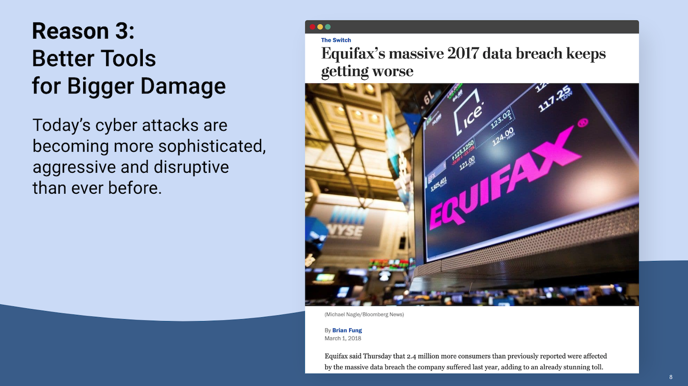
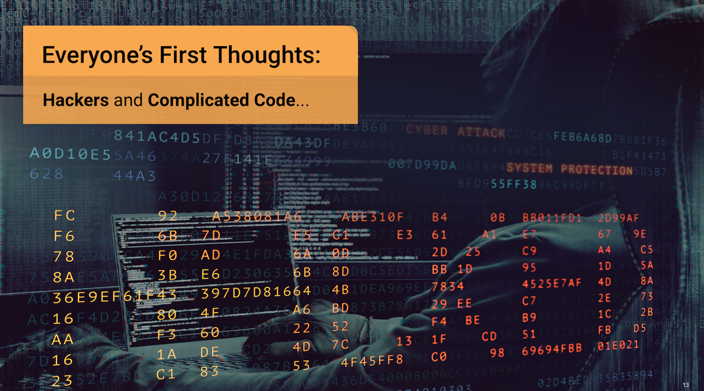
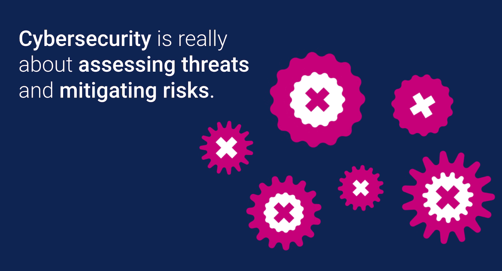
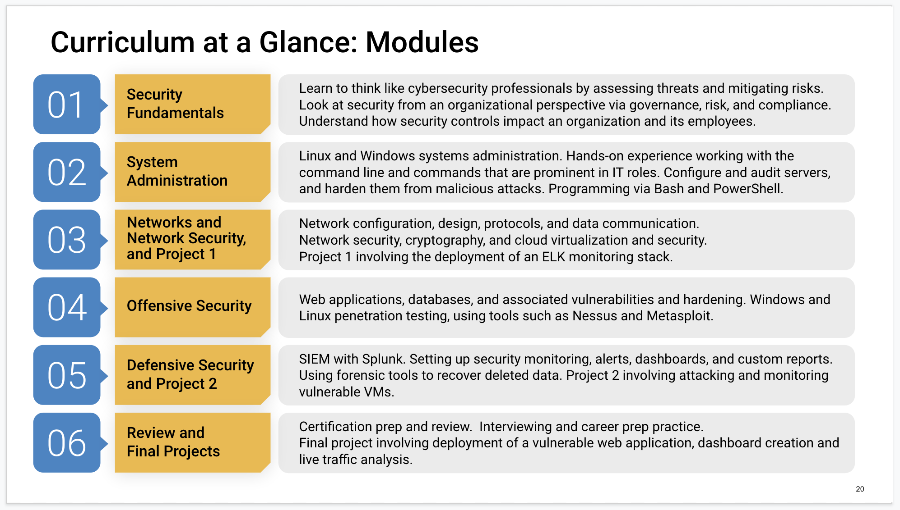
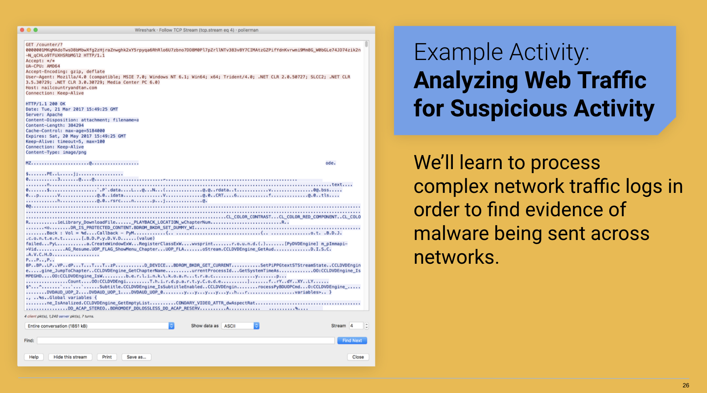
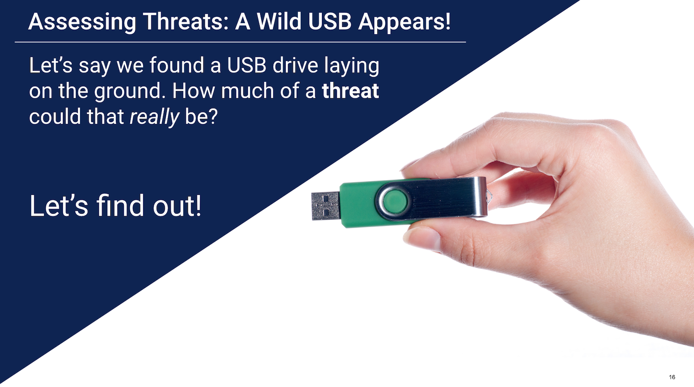

## 1.1 Lesson Plan: The Cybersecurity Mindset

### Overview

In today's class, students will familiarize themselves with the structure of the course and learn about some of the topics that the course will cover. Toward the end of class, students will learn about the CIA triad and complete a group activity. 

Have fun with these activities and be extra encouraging to students today on their first day of class!

### Class Objectives

Students should leave today's class feeling completely welcome, excited, and ready to begin the rigorous journey ahead. Today they will introduce themselves and complete group activities to set a tone of collaboration and support for the course. 

By the end of class, students will also be able to: 

- Explain the course structure and general direction of the program.

- Recognize the high-level security strategies and tools that the class will cover.

- Define cybersecurity as the assessment of threats and the mitigation of risk.

- Define the CIA triad and its elements.

### Instructor Notes

- First, welcome! And thank you for being a part of our program. Because of instructors and TAs like you, we're helping thousands of students achieve their goals and creative dreams. You've got a long road ahead and plenty of time to make an impact. So buckle in! You're in for a fun ride.

- Today's class is *all* about making the students feel comfortable. This means letting them know, from the start, that you and your TAs are committed to their success. Many of your students will be nervous on the first day, so do what you can to engage them as friends. Make sure they know that you will support them through the struggles ahead.

- Because of students' nerves, it's very important that you are *extra* prepared for today's class. Practice the presentation at home. Make sure you understand your presentation and feel comfortable with the transitions. Don't repeat the entire lesson from memory, but push yourself to be polished. On the first day, students will be extra aware of your hesitations and will be extra concerned if you seem unprepared. Later, when you've established rapport with your students, you can lighten your preparation a bit. 

- In keeping with the theme of comfort, today's class is also about making sure students are comfortable with *each other*. Many of your students will enter class unsure of what to expect. They might think back to previous learning experiences filled with dull lectures, high-stakes exams, and frequent, nagging feelings of insecurity. It's important they know that this class will be different. As an instructor, your objective is to ensure that the class is a vibrant learning community. 

- Toward that end, today's class is filled with thought exercises. Do your part as instructors and TAs to ensure that these group activities get students more comfortable with each other and lead to meaningful conversations. Be sure to monitor students' progression through the activities, ask students probing questions, and do your part to keep the environment lighthearted.

- Today's class includes the first slideshow. If you like, modify the slides to your own style, but be sure to cover the key activities. 

  - **Note**: If you decide to modify the slides, you will need to make a copy.  

- Introductions often take a long time. But they are important for establishing the group dynamic. You can adjust today's lesson plan by removing the last activity if you run out of time. 

- In the next class, students will set up their virtual machine environments. Make sure students have Vagrant, VirtualBox, and GitBash (Windows) by the next class. 

### Online Classroom Strategies 

Refer to the following guidelines and best practices for conducting this class online: 

- [Cybersecurity Online Classroom Strategies](../../../00-Teaching-Staff-Prework/OnlineStrategies.md)


### Slideshow 

You can find the lesson slides on Google Drive here: [1.1 Slides](https://docs.google.com/presentation/d/1kKDhzqX3sgngsyYQwVY8xuU1TshhSoxcjVceTMRwGPA/edit)

- To add slides to the student-facing repository, download the slides as a PDF by navigating to File > "Download as" and choose "PDF document." Then, add the PDF file to your class repository along with other necessary files.

- **Note:** Editing access is not available for this document. If you or your students wish to modify the slides, please create a copy by navigating to File > "Make a copy...".  

- We recommend you use the slides in the Google Slide web application. Downloading the slides and opening them in PowerPoint may cause formatting errors. 

### Time Tracker

The time tracker is available on Google Drive here: [1.1 Time Tracker](https://docs.google.com/spreadsheets/d/1lRuc_70GJ5iT7A26_MRMgfwEYjRIO5mGpykjtycE6Pw/edit#gid=0)

### Student Guide

Distribute the student-facing version of the lesson plan: [1.1 Student Guide](StudentGuide.md).


-------

### 01. University/SSM/Instructor Do: Introductions (0:40)

The first 40 minutes of class consists of introductions by the university, program director, student services director, and career coach. After these introductions, students will introduce themselves. 

- **Instructor/TA Note**: You can just relax for now. Your time for introductions is coming up. Try to keep things lighthearted as students share their backgrounds.

- Once students finish introducing themselves, have TAs introduce themselves as well.

- Then, introduce yourself and discuss a story or two to demonstrate your experience in the field.

### 02. Instructor/SSM Do: Begin Slideshow and SSM Introduce CompTIA (0:02)

Use the [1.1 slide deck](https://docs.google.com/presentation/d/1tE0-zCrD-jathqQy2VlovqPbp7qRpOC-AQUZ1nYlVzo/edit#slide=id.g4f80a3047b_0_990) to guide the rest of class. 

- Have your TAs keep track of time. Make sure to check in with them to ensure you are staying on schedule. 

- Be concise when you can!

:warning: **Heads Up**: The first slide introduces the CompTIA benefits that are included with the course for the students. Please let your SSM discuss this slide with the class, then you can continue with the rest of class.

### 03. Instructor Do: The Rise of Cyber (0:20)

Now it is time to explore why cybersecurity is such a popular skill today.

- Use the slides to help guide your discussion, pointing out the following:

  - Dependence on IT systems has grown immensely in recent years. 

  - There are more users online, meaning more potential targets. 

  - Cybercriminals are getting increasingly sophisticated and aggressive, and launching attacks with greater audacity.

  - Cybercriminals are getting more organized. 

  - There aren't enough skilled security professionals to fill all the available jobs.

As you are discussing these slides, find opportunities to engage students in thoughtful reflection. Encourage students to discuss their opinions and experiences. 

- For example: Ask them to share examples of breaches they've learned about in the news.

  

#### Defining Cybersecurity

:question: **Ask class**: What does the word cybersecurity bring to mind?

After you've been given a few answers, acknowledge the validity of their responses.

- Using the slides as guidance, explain that cybersecurity isn't really about complicated code and cybercriminals, as it is so often portrayed. 

- Cybersecurity, as we will understand it in this course, is about **assessing threats** and **mitigating risks**. 


  

  

Explain that students will have the opportunity to assess threats and mitigate risks in an upcoming thought exercise. First, we are going to provide an overview of the course and the tools we'll use. 

### 04. Instructor Do: Course Overview (0:15)

In this section, we will provide a high-level overview of the course, including the topics covered, technical tools used, projects, and resources provided. 

#### Course Structure

Explain that students can think of this boot camp as six modules that each focus on an important piece of the vast cybersecurity landscape: 




**Module 1**: Security Fundamentals (Units 1-2)

- The first two weeks of the program is largely conceptual. This week, students will learn how to think like a security professional, explore the cybersecurity career landscape, and get an introduction to certifications in the space. 

- Next week, we will finnd out about governance, risk, and compliance. Students will explore security from an organizational perspective via governance, risk, and compliance, and how these topics affect security controls and other decisions.

**Module 2**: System Administration (Unit 3-7)

- Beginning in Unit 3, we will use technical lab environments to complete activities. Students will get comfortable using the command line and will hone their systems administration skills in the several units that follow. 

- We will cover both Linux and Windows systems, and start programming with both Bash and PowerShell. Students will configure and audit servers, and harden them from malicious attacks.

**Module 3**: Networks and Network Security and Project 1 (Units 8-13)

- Security professionals are expected to have a strong foundation in networking. In this module we’ll cover topics such as network configuration, design, ports, protocols, and data communication. 

- We’ll practice analyzing data packets on the wire and investigating network security attacks and hardening, and cover a variety of topics in cryptography. This module will also examine cloud virtualization and security, and students will complete their first project.

**Module 4**: Offensive Security (Units 14-17)

- With our networking foundation now established, we’ll explore a variety of offensive topics in security. 

- We’ll start with web architecture and then explore common web vulnerabilities and the hardening techniques associated with them. We’ll then cover ethical hacking and penetration testing, and will use tools like Metasploit.

**Module 5**: Defensive Security and Project 2 (Units 18-21)

- We’ll now examine defensive security monitoring and spend a few weeks diving into SIEM with Splunk. We will set up security monitoring, and create alerts, dashboards, and custom reports. 

- Students will gain an understanding of the incident response framework, and learn how to respond to breaches and incidents. We’ll also spend a unit on forensics, and will use tools to recover deleted data and solve a sample forensics case.

**Module 6**: Review and Final Projects (Units 22-24)

- At this point, we’ve covered a lot! It’s time for some focused certification and career prep and review. We will focus primarily on the Security+ exam but will also spend one day of our Certification unit on the CISSP and CEH exams. 

- There will also be a short unit on career prep, where we will hone our resumes, sharpen our networking skills, and get practice with both behavioral and technical interviewing. 

- We will finish the program with a final project.

#### Example Assignments

Using the slides, provide some examples of assignments students will complete during this course. 



- Cybersecurity Policy and Strategy Analysis

- Linux Scavenger Hunt: At the end of the Module 2, students will work in groups to find a series of flags on a Linux server.

- Networking Capture the Flag: At the end of the Networking units, students will work in groups to investigate data packets and find a variety of flags that tie to various networking concepts.

- Master of the SOC: At the end of the SIEM units, students will work in groups to create a custom security operations center and use the monitoring tools they set up to analyze and protect their organization from potential attacks. 


#### Projects

These modules and assignments will culminate in three projects:

- **Project 1: ELK Stack**. The first project follows the Networking and Cloud Security units. Students will deploy an ELK monitoring stack within their virtual networks.

- **Project 2: Red vs. Blue Team**. Students will work as penetration testers and SOC analysts to attack and monitor vulnerable VMs. 

- **Project 3: Final Project**. In this second Red vs. Blue Team project, students will exploit a vulnerable web application, create dashboards to see alerts in real time, and analyze live traffic on a virtual network. 

#### Tools We'll Use

While the first couple of units will primarily focus on fundamental cybersecurity concepts, we will quickly shift to applying IT, networking, and cybersecurity skills in technical environments. 

We will mostly use **virtual machines** to operate the various operating systems and tools throughout the curriculum. 

- Explain that we will go into more detail about the use cases of virtual machines (VMs) in the next class.

- For now, explain that virtual machines allow us to run different operating systems. We can download and install virtual machines onto our computer. In cases where we will need to use more than one virtual machine, we will access a network of those machines on the cloud. 

- For example: If you have a Windows laptop and want to run a program that is only available on a Mac operating system, you can run a virtual machine on your computer to simulate a Mac on your Windows machine. 

- You can also have this virtual machine deployed on the cloud and connect your computer to that machine. 

- These are simple examples, but they demonstrate why we use VMs. Different operating systems provide different capabilities and access to tools.

You will use three kinds of lab solutions throughout this class:

- Vagrant local virtual machines
- Azure Cloud Lab Services
- Personal Azure Cloud accounts

Next, we'll cover each of these categories in depth. 


#### Vagrant Local Virtual Machines 

Starting in Week 3, we will use a Linux Ubuntu virtual machine to complete many systems administration, networking, monitoring, programming, and other tasks. 

To run this virtual machine, we will use the following tools, which students should have already downloaded during prework:

- **VirtualBox** is a virtualization tool we will use to run various lab activities. VirtualBox allows us to run different operating systems on our local machines. 

- **Vagrant** is a tool we'll use to build and set up these virtual environments. Vagrant allows us to run scripts that install these virtual machines, which will then be run using VirtualBox. Vagrant also allows us to easily update to the most recent version of the virtual machine, which makes it easy for us to get any important updates to our virtual machines. 

- **Terminal or Git Bash**: We will use the command line to download, install, and access our machines. Don’t worry if you’re not familiar with the command line—it will be covered in upcoming units! Mac users will use Terminal, which is already installed on their computers. Windows users will need to download and install Git Bash. 

Explain that in the next class, we will learn more about the above tools and also download, install, and get our Vagrant virtual machines set up. Students who have never used the command line before should plan to spend additional time making sure everything is set up and running smoothly. 

| :warning: Necessary Installations :warning: |
|:-:|
| We will set up the virtual machine environments in the next class. Students should install VirtualBox, Vagrant, and GitBash before then. Instructions and more details are available in the prework.   |

We will use Vagrant with Virtual Box in the following units: 

- Terminal
- Linux Systems Administration
- Linux Archiving and Logging Data
- Bash Scripting and Programming
- Networks I and II
- Cryptography
- Web Development
- Web Vulnerabilities
- SIEM I and II

#### Azure Lab Services

Explain that other units will require the use of multiple virtual machines. Ask the class if they can think of reasons why we would need to run multiple virtual machines at the same time. 

Examples include: 

  - To practice offensive security, we need an attacking machine and a vulnerable target machine. It would be unethical and most likely illegal to attack actual targets. Therefore, we need to set up target machines to attack. 

  - To set up and monitor alerts during our defensive security units, we need a machine that is equipped with these monitoring and alerting capabilities and a machine to simulate an attack so we can test the monitors. 

  - To ensure data and resources remain available if a main machine goes offline, we can create multiple machines to use as backups.

Since these lab environments are in the cloud, students will not need to download any tools. However, they will need to register and get set up using Trilogy-provided access credentials. 

In Unit 6, Day 3, students will receive these credentials along with the registration link to their first Azure lab environment, Windows. Instructors will demonstrate how set up Azure Lab Services.

Each unique lab environment in the program will need a new registration link. Instructors will send the new registration link to students before the start of the unit that requires that environment. All students need to do is click the registration link and they should have immediate access to the new lab environment with their Azure Lab Services dashboard. 

We will use Azure Lab Services in the following units:

- Windows
- Network Security
- Pentesting I and II
- Project 2
- Forensics
- Final Project


#### Personal Azure Accounts

During Units 12 (Cloud Security) and 13 (Project 1) students will use personal Azure accounts. Students need these personal accounts in order to deploy secure virtual networks to their own personal cloud environments. We do not allow students to deploy networks to Trilogy-owned cloud environments for security reasons.

Students must register themselves for these personal Azure accounts, and will do so in class during Unit 11, Day 3. 

| :warning: Person Azure Account Requirement :warning: |
|:-:|
| When creating a personal Azure account, you will be asked to provide a credit card. While required, you will not be charged any money. You will also be provided $200 credit. Do not sign up for this account or use these credits before you are explicitly prompted to by your instructor.   |


#### Student Resources

Finally, explain that students will have access to many resources for additional learning and review. These include:

- **Student Unit Syllabi**: These syllabi will contain weekly overviews of the unit. They will set expectations and provide additional support and material for continued learning. 

- **Student Guides**: Student guides are student-facing versions of the lesson plan. Students can use these to follow along with instructor demonstrations and review the content covered in each class.

- **Slides**: Students will also have access to the slideshows used in class. 

Ask if students have any questions about the technical infrastructure of the course before moving on.

Remind students that they will spend the second half of the next class setting up their local virtual machines. 

Make sure to distribute the following to students at the end of this section:

- [Cybersecurity Lab Solutions Breakdown](https://docs.google.com/document/d/1SGzZHWmxZY76cGzYzOhGsmmuOeVAH2nvQDQY3r9PGXw)
 
### 05. Instructor Do: Online (0:10)

:globe_with_meridians: Take this time to acknowledge the online nature of this boot camp and some of the tools we'll use to facilitate and optimize learning in an online environment. 

Let students know that this class will be collaborative and students will spend plenty of time working together on activities. The course is designed to be a learning community. This first week is about making sure students are comfortable with one another. 

#### Tips for Students
Review the following tips to help your students get the most out of our online classroom:

- **Get to know your classmates and instructors**. You’ll get more out of the course if you perceive yourself as part of a shared community. Social connection can be difficult to develop through a computer screen, but there are ways to get to know your fellow classmates. Participate in class and in your cohort’s Slack space (more on Slack coming up). You don’t have to get too personal, but you can share your security interests and career goals.

- **Treat class time like you would a live class**. If you were sitting in a classroom, there would not be many potential distractions around you. Likewise, you should make the physical area where you sign on to class as distraction free as possible. If you can, go to a quiet room, turn on silent mode on your phone, and ask others in your home to avoid distracting you while you’re online.

- **Budget time for classwork**. In an online environment, it can be harder to keep track of due dates for assignments. Deliberately scheduling time throughout the week for your coursework will help. Set aside three hours, three to four times a week, for studying and doing homework. Your work won’t be overwhelming this way, and you won’t be working on assignments at the last minute!

Next, introduce some of the tools and strategies you’ll be using in this class to optimize the experience.

#### Zoom Online Best Practices

Assure students that it’s okay if they are not familiar with using Zoom in a classroom environment and that you will model good Zoom behaviors throughout the program.

Send the following link that highlights Zoom features like hand raising, polling, screensharing, and breakout rooms.

- [Zoom Features](https://trilogyed.wistia.com/medias/tpycnx2e34)

Cover several recommended best practices:

**Instructor Note**: If you like, you can add to the list of best practices. Remember to update slides if you do.

- **Always mute your microphone.** If you are not speaking, mute your microphone.

- **Set your first and last name**. Help everyone get to know you by using your full name as your screen name.

- **Keep your video on**. Be present during the online class. This includes showing your face.

- **Raise your hand or use Slack for questions**. Don't interrupt a lecture. Use the hand raise feature in Zoom or ask the question via Slack.

  - Remind students that you and a TA will answer questions after or during the lecture when appropriate.

  - **Instructor Note:** Remember to check your Slack channel and Zoom hand raise feature regularly to see and respond to students' questions.

- **Use headphones with microphones**. Background noise and feedback echos can be an issue for some when using your computer mic and speakers. Use headphones with a microphone to improve sound quality and clarity when speaking.


#### Slack

Explain that Slack is an online communication tool that is like a forum, instant messenger, and email all rolled into one. It's used by countless organizations worldwide, and you'll be using it every single day for the next six months.

- We will use Slack to send code snippets during class, share important announcements, and facilitate group exercises. 

- Students should have received the link to their class-specific channel during orientation. Though there is a Slack web application, for this course everyone should have the program installed on their machine.

#### Bringing Engagement to the Online Classroom

Explain that throughout class, we’ll use techniques to add engagement. Cover some of the techniques listed below:

- The instructor will not be the only person speaking! During demos and reviews of activities, we’ll pause to ask questions. 

- Students should submit questions via the appropriate Slack channels. Instructional staff will make sure to cover as many of them as possible at the end of a section.

- We will use **breakout rooms** regularly throughout the course, starting with a group activity after the break.

- We recommend **checking comprehension with class polls** throughout class. At a minimum, do this at the end of every activity review. Class polls provide students with an opportunity to *anonymously* indicate their level of understanding of the previous activity. This icon indicates the poll feature: :bar_chart:

  - Both [Zoom](https://support.zoom.us/hc/en-us/articles/213756303-Polling-for-meetings) and [Slack](https://slack.com/help/articles/229002507-Create-a-poll-) provide a poll feature. 
  
  - Use these features to conduct comprehension checks and evaluate how well students understand concepts covered in activities. 

  - Polls can be as simple as the following: 

    ```
    How comfortable are you with <topic>?

    A. It was easy. I am ready to move on. 

    B. It was challenging, but I understood and completed it. 

    C. It was too challenging. I wasn't able to complete it. 

    ```

  - Students who indicate low comprehension should seek out help from the instructional staff during office hours.   

For more information and instructions on conducting class in an online environment, refer to this document: 

  - [Online Class Guide](../../../00-Teaching-Staff-Prework/OnlineStrategies.md)

Ask if students have any questions before our break. Explain that after the break, we will begin the first lesson and activity. 

### 06. Break (0:15)

### 07. Instructor Do: Introduction to First Activity and Breakout Groups (0:05) 

Explain that in this activity, students will start to think like cybersecurity professionals. 

- Remind them of the main tasks of cybersecurity: assessing threats and mitigating risks. 

- These two tasks often require creativity and outside-the-box thinking.

:globe_with_meridians: This activity will use **breakout groups**. 

- For this activity, divide students into groups of 3-4 and send them to their breakout rooms. 

- :warning: **Heads Up**: Keep one group in the main room to preserve the class recording. 

- For more instructions on how to set up breakout rooms, and more information about online procedures, refer to this link: 
    
  - [Online Class Guide](../../../00-Teaching-Staff-Prework/OnlineStrategies.md)

- We will get faster at this down the road but getting set up in the first breakout room might take some time. 
 
Give students a little time to get into the activity. Then, you and the TAs can move around the breakout rooms to see how it's going and help students.

Also explain that for each activity, students will access an "activity file" on GitLab that will provide the instructions. 

### 08. Student Do: Assessing Threats (0:15)

Explain the following: 

- To an experienced cybersecurity professional, threats exist everywhere, even in the most common technologies. 

- In this activity, you will work in groups to evaluate the potential threats posed by various technologies. 



Assign students to their breakout rooms and send them the following file: 

- [Activity File: Assessing Threats](Activities/09_Assessing_Threats/Readme.md)


### 09. Instructor Review: Assessing Threats (0:15)

Spend this time asking different groups to share their answers.  

When reviewing, include specific instances of real-life application of these example threat assessments.

- For example, during a penetration test, a company might purchase 25-50 of these USB drives and drop them in random spots at the target organization's locations. When someone picks one up and plugs it into a computer, it creates a connection and gives remote access to that computer. 
  - Ask if anyone can explain what a penetration test is.


### 10. Defining the CIA Triad (0:10)

Explain that we will now move on to our first cybersecurity concept: the **CIA triad**. 

The CIA triad highlights the three cornerstones of information security: **confidentiality**, **integrity**, and **availability**.


:question: **Ask class**: Define the three key terms in your own words: What is confidentiality? What is integrity? What is availability?

Using the slides as a scaffold, discuss the defining characteristics of the CIA triad:

- **Confidentiality**: The state of keeping or being kept secret or private.

  - This corner of the CIA triad is all about ensuring sensitive information does not reach unauthorized people.

  - Some examples of confidentiality attacks include uploading private photos and communications onto a forum or exposing credit card numbers online.

  - Confidentiality comes down to the principle of "need to know": Data or information should only be made available to those who need access to it.

  - Confidentiality is supported or enforced through various other measures, like encryption, authentication, etc.

- **Integrity**:  The quality of being honest, whole, or undivided.

  - The integrity of information refers to protecting information from being modified by unauthorized people.

  - Some examples of integrity attacks include intercepting money transfers and changing the amount in seemingly insignificant ways, allowing for the excess to be sent elsewhere, or altering the grades at a university to be better or worse.

  - These kinds of attacks can be prevented by using a secure hashing algorithm and process when transferring data to ensure it isn't tampered with in transit.

- **Availability**: The quality of being able to be used or obtained.

  - Availability concerns occur when operating systems, equipment, and data are not functioning correctly and thus are not accessible by those who need it.

  - Some examples of an availability attack include cybercriminals taking down a web-connected generator to disable a critical power supply or using a denial of service attack to bring down a financial service provider's website, making it impossible for clients to make transactions.

  - Creating regular backups of data is one way to maintain availability.

Emphasize that cybersecurity is concerned with the confidentiality, privacy, and integrity of data and data systems.

- We will revisit these terms regularly throughout the program and will explain how the various topics, skills, and practices are concerned with protecting confidentiality, privacy, and integrity.

### 11. Student Do: CIA Triad and Security Scenarios (0:15)

- In this activity, students will analyze a variety of brief security scenarios and identify which element of the CIA triad—confidentiality, availability, or integrity—each situation is concerned with.

:globe_with_meridians: Assign students new groups of 3-4 and move them into breakout rooms. 

- :warning: **Heads Up**: Keep one group in the main room to preserve the class recording. 

- For more instructions on how to set up breakout rooms, and more information about online procedures, refer to this link: 
    
  - [Online Class Guide](../../../00-Teaching-Staff-Prework/OnlineStrategies.md)

Send the following activity file: 

- [Activity File: CIA Triad and Security Scenarios](Activities/12_CIATriad/Unsolved/Readme.md)

### 12. Instructor Review: CIA Triad and Security Scenarios (0:10)

:bar_chart: Using [Zoom's](https://support.zoom.us/hc/en-us/articles/213756303-Polling-for-meetings) or [Slack's](https://slack.com/help/articles/229002507-Create-a-poll-) poll feature, conduct a comprehension check and evaluate how well students completed the activity. 

Use the solution guide to review the answers. Move between groups and have them share their answers and thoughts. 

If a group provides an incorrect answer, before saying it is wrong, ask the class if they agree with the answer the group provided. Why or why not? Then, have another group provide the correct answer. 

- [Solution Guide: CIA Triad and Security Scenarios](Activities/12_CIATriad/Solved/Readme.md)

### 13.  Instructor Do: Wrapping Up and Moving Forward (0:05)

Congratulate students on completing the first day of this boot camp! The pace will pick up quickly, and soon they will complete assignments and projects that showcase a completely new set of skills and comprehension.

Make sure to distribute the student-facing version of the lesson plan: 

- [1.1 Student Guide](StudentGuide.md)

- These students guides are available for every single class. You should also provide the slide link to students. 

- Depending on your preference, distribute these resources to students before or after class. 

#### Moving Forward

Explain that next class, we will do a deeper exploration of assessing risk and mitigating threats by evaluating specific attacks and vulnerabilities of users, web applications, servers and databases.  

We will also complete our first technical activity by setting up the virtual machines that we will use throughout the course. 

- :warning: **Heads Up**: Students should try to download VirtualBox, Vagrant, and Git Bash (Windows) in preparation for the next class. Installation instructions are available in their prework. Students will receive additional assistance during the next class and during office hours.  

Further ahead, in the final day of this unit we will examine cybersecurity domains, career pathways, and certifications. 

----

© 2020 Trilogy Education Services, a 2U, Inc. brand. All Rights Reserved.    
